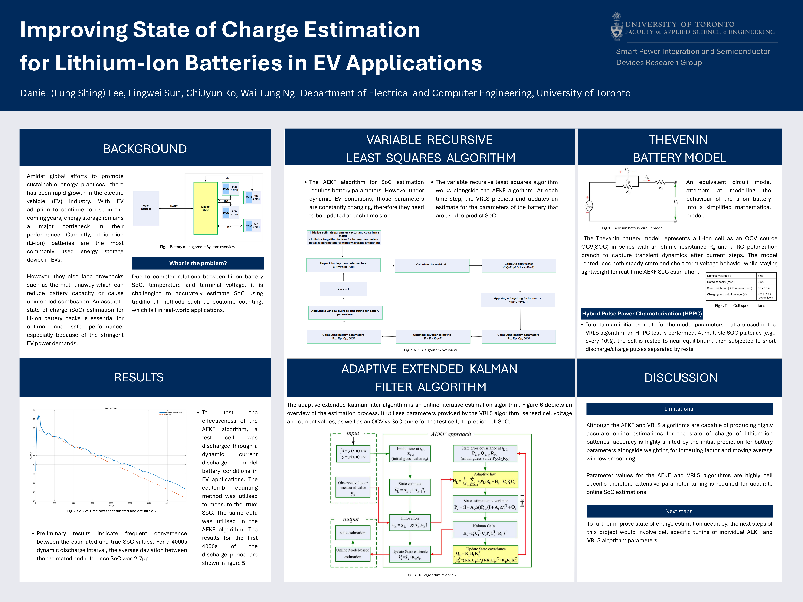

# Adaptive Extended Kalman Filter for Battery State-of-Charge Estimation

Real-time state-of-charge (SOC) estimation for lithium-ion battery packs using an adaptive extended Kalman filter (AEKF) implemented in C. Developed as undergraduate research at the University of Toronto's Smart Power Integration and Semiconductor Devices Research Group under Prof. Wai Tung Ng.



---

## Overview

Accurate SOC estimation is critical for battery management systems in electric vehicles — it determines range prediction, charge control, and cell protection. Traditional methods like coulomb counting fail under real-world EV conditions due to complex relationships between SOC, temperature, and terminal voltage.

This project implements an adaptive extended Kalman filter that continuously estimates SOC in real time by fusing voltage and current measurements with an electrochemical battery model. A variable recursive least squares (VRLS) algorithm runs alongside the AEKF to update battery model parameters online as they drift with temperature and aging.

The algorithm achieves **~2.7 percentage points average deviation** between estimated and true SOC over a 4000-second dynamic discharge interval.

---

## Technical Approach

### Battery Model — Second-Order Thevenin Equivalent Circuit

The battery is modelled as an OCV source (function of SOC) in series with an ohmic resistance R₀ and an RC polarization branch to capture transient dynamics after current steps. The model reproduces both steady-state and short-term voltage behaviour while staying lightweight for real-time AEKF estimation:

```
        R0          R1          R2
  ──┤├──/\/\/──┬──/\/\/──┬──/\/\/──┬──
               │         │         │
              C1        C2        Vt
               │         │         │
  ─────────────┴─────────┴─────────┴──

  Vt = OCV(SOC) - I·R0 - V_RC1 - V_RC2
```

The model parameters (R0, R1, R2, C1, C2) are identified experimentally via HPPC testing and updated online during operation by the VRLS algorithm.

### State Estimation — Adaptive Extended Kalman Filter

The AEKF is an online, iterative estimation algorithm. It predicts the next state using the battery model, then corrects that prediction using the measured terminal voltage. The state vector includes SOC and the two RC voltages:

**State vector:** `x = [SOC, V_RC1, V_RC2]`

The adaptive component adjusts the process noise covariance matrix Q online based on the innovation sequence (difference between predicted and measured voltage). This allows the filter to handle model mismatch and parameter drift — when predictions diverge from reality, the filter automatically increases its reliance on measurements.

### Online Parameter Identification — Variable Recursive Least Squares (VRLS)

Battery parameters are constantly changing under dynamic EV conditions. The VRLS algorithm works alongside the AEKF, predicting and updating estimates for the battery model parameters (R0, R1, C1, OCV) at each time step. A variable forgetting factor controls how quickly old data is discounted, with exponential window smoothing applied to the parameter estimates.

### Cell Characterization — HPPC & Dynamic Discharge Testing

Initial model parameters were obtained through laboratory testing on lithium-ion cells (3.63V nominal, 2000mAh rated capacity, 65 × 18.4mm, 4.2–2.75V operating range):

- **Hybrid Pulse Power Characterization (HPPC):** at multiple SOC plateaus (every 10%), the cell is rested to near-equilibrium, then subjected to short discharge/charge pulses separated by rests to extract resistance and time-constant parameters
- **Dynamic discharge tests:** current profiles mimicking EV drive cycles to validate model accuracy under realistic conditions
- **OCV-SOC curve:** low-rate discharge to map open-circuit voltage as a function of state of charge

Test data was processed in MATLAB and Python to extract initial parameter estimates and generate OCV lookup tables.

---

## Results

- **~2.7pp average SOC deviation** over 4000s dynamic discharge (estimated vs coulomb-counting reference)
- Frequent convergence between estimated and true SOC values throughout the discharge profile
- Real-time convergence from incorrect initial SOC estimates
- Online parameter tracking adapts to changing cell conditions

### Limitations & Next Steps

- Accuracy is limited by the initial prediction for battery parameters alongside the forgetting factor and moving average window smoothing
- AEKF and VRLS parameter values are highly cell-specific, requiring extensive tuning for accurate online estimation
- Next steps involve cell-specific tuning of individual AEKF and VRLS algorithm parameters to further improve accuracy

---

## Project Structure

```
aekf-bms/
├── src/
│   ├── aekf.c / aekf.h           # Adaptive extended Kalman filter
│   ├── vrls.c / vrls.h           # Variable recursive least squares parameter ID
│   ├── battery_model.c / .h      # Second-order Thevenin model
│   └── ocv_table.c / .h          # OCV-SOC lookup table
├── matlab/
│   ├── hppc_analysis.m           # HPPC test data processing
│   ├── param_extraction.m        # Initial parameter extraction
│   └── validation_plots.m        # SOC estimation vs ground truth
├── data/
│   ├── hppc_raw/                 # Raw HPPC test data
│   └── dynamic_discharge/        # Drive cycle test data
├── poster.png                    # Research poster
└── README.md
```

---

## Tools & Technologies

| Tool | Usage |
|---|---|
| C | AEKF and VRLS algorithm implementation |
| MATLAB | Test data processing, parameter extraction, validation plotting |
| Python | Data pipeline and analysis scripting |
| Lab Equipment | Battery cycler, thermal chamber, data acquisition |

---

## Skills Demonstrated

`State Estimation (Kalman Filtering)` `Battery Modelling` `Recursive Least Squares` `Embedded C` `MATLAB` `Signal Processing` `Electrochemical Systems` `Experimental Characterization`

---

## Authors

- **Daniel (Lung Shing) Lee** · [linkedin.com/in/lee-lung](https://linkedin.com/in/lee-lung) · [daniellee.lovable.app](https://daniellee.lovable.app)
- Lingwei Sun
- ChiJyun Ko
- Prof. Wai Tung Ng (Supervisor)

**Lab:** Smart Power Integration and Semiconductor Devices Research Group, Department of Electrical and Computer Engineering, University of Toronto

Summer 2025
